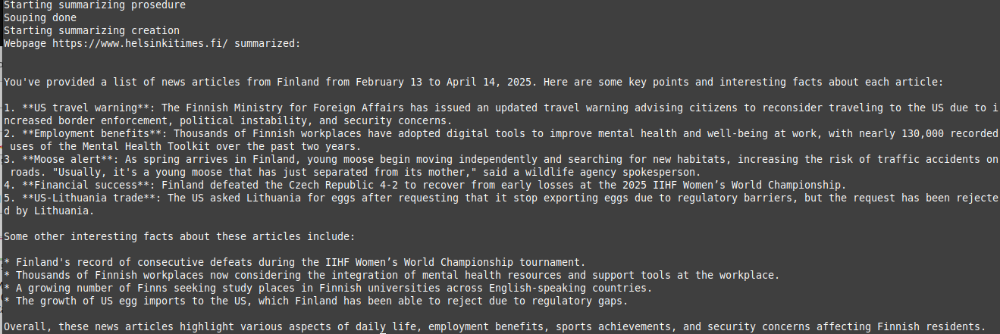

# 📰 AI_LLM_News_Scraper

**AI Bot to Summarize News Websites Using Local LLMs**

---

## 📌 What it does

This project fetches a news website (e.g. [Helsinki Times](https://www.helsinkitimes.fi/)), cleans up the content, and generates a summary using a local Large Language Model (LLM).

---

## ⚙️ Tech Stack

- **Language Model**: LLaMA 3.2 1B (via [Ollama](https://ollama.com/))  
- **Hardware**: Runs locally on a Lenovo ThinkCentre M710q  
  _(Intel Core i5-7400T, 4 cores, 25 GB RAM, no GPU)_  
- **Frameworks/Libraries**: Python, BeautifulSoup, requests, OpenAI client

> Chosen LLM is lightweight and fast, suitable for low-end machines.

---

## 🎓 Inspired by

> _Udemy Course:_ **LLM Engineering: Master AI, Large Language Models & Agents**

---

## 🛠️ Installation (Linux)

### 1. Install Ollama

```bash
curl -fsSL https://ollama.com/install.sh | sh
```

### 2. Download the model

```bash
ollama run llama3.2:1b
```

### 3. Clone the repository and install Python dependencies

```bash
git clone https://github.com/mnokka/AI_LLM_News_Scraper.git
cd AI_LLM_News_Scraper
pip install -r requirements.txt
```

---

# 🚀 Running the Tool

```bash
python3 summarize.py
```





